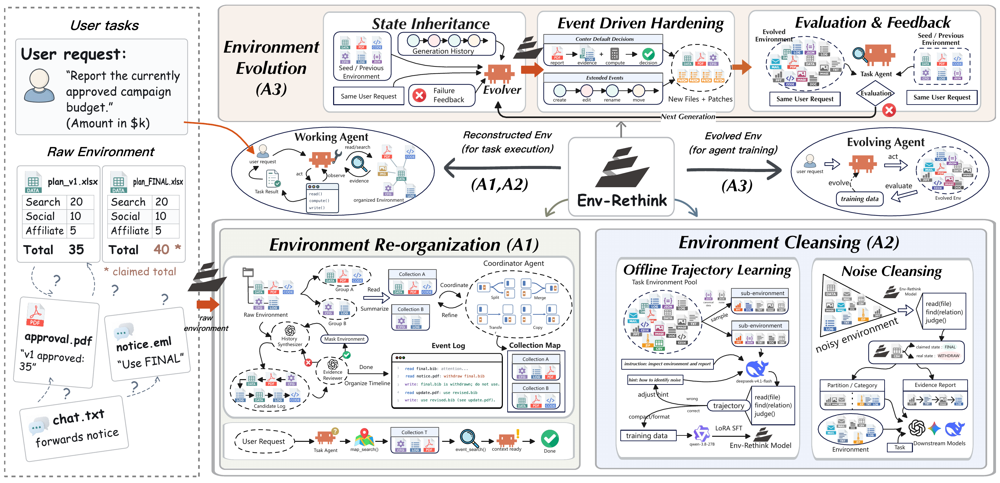
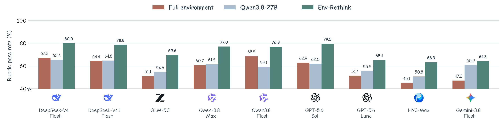
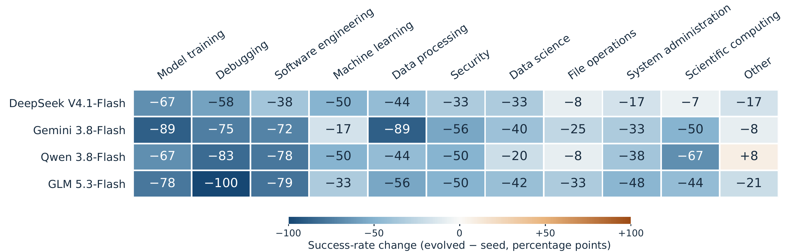

<div align="center">
  <h1>Env-Rethink</h1>
  <h3>Breaking the Environment Wall</h3>
  <p>A Unified Framework for Preparing and Evolving Agent-Native Environments</p>
  <p>
    <a href="#overview">Overview</a> ·
    <a href="#method">Method</a> ·
    <a href="#results">Results</a> ·
    <a href="#quick-start">Quick Start</a> ·
    <a href="#documentation">Documentation</a>
  </p>
</div>

## Overview

Env-Rethink prepares persistent file-based environments for reliable agent execution and evolves them into harder, verifiable challenges. It addresses fragmented context, conflicting versions, and misleading evidence.

<div align="center">
  
</div>

## Method

| Component | Approach |
|---|---|
| **A1. Environment reorganization** | Collection Maps group related files; evidence-reviewed synthetic Event Logs expose their relationships. |
| **A2. Environment cleansing** | A LoRA-trained Qwen3.8-27B verifier selects files and reports evidence after learning from qualified tool-use trajectories. |
| **A3. Environment evolution** | Event-driven state changes produce harder instances with updated reference answers and evaluators; the user request stays fixed. |

The learned verifier runs without the downstream request; a separate task agent executes that request using the prepared evidence.

## Results

| Evaluation | Baseline | Env-Rethink | Change |
|---|---|---|---|
| Downstream rubric pass rate, full environment | 57.6% | **72.7%** | **+15.1 pp** |
| Downstream rubric pass rate, Qwen3.8-27B preparation | 59.4% | **72.7%** | **+13.3 pp** |
| Held-out file-partition accuracy, Qwen3.8-27B baseline | 56.2% | **76.5%** | **+20.3 pp** |

Downstream means span nine models on 30 Environment-Hard tasks, with 1,280 rubric checks per model. File-partition accuracy covers 15 held-out task environments and 617 files. **pp** denotes percentage points.

<div align="center">
  
</div>

Evolution decreased success by at least 20 percentage points for at least three of four models on **32 of 55 retained paired Terminal-Bench 2.1 tasks (58.2%)**.

<div align="center">
  
</div>

Category means use available pairs with nonzero seed success.

## Quick Start

### Prerequisites

- **Python 3.11 or 3.12**, matching the `envgen` package constraints.
- **Linux with Bash**, or a suitable WSL2 environment, for the container workflows below.
- **Docker and Docker Compose v2** for agent execution and task verification.
- **Compatible model endpoints and API credentials** for model-based generation, curation, agent runs, and judging.

Commands use Bash and start from the repository root unless stated otherwise. The first example uses a small local workspace and requires no Docker, model credentials, or benchmark download.

### Install the Core Dependencies

```bash
python3 -m venv .venv
source .venv/bin/activate
python -m pip install -r envgen/requirements.lock.txt -r hardening/requirements.txt
```

These dependencies cover `envgen` and the hardening tools. Full workspace evaluation also requires a prepared runtime image and its harness-specific dependencies; the complete upstream Workspace-Bench build context and Python dependency manifests are not included in this snapshot.

### Generate a Snapshot Event Log

```bash
mkdir -p envgen/.generated/demo-workspace
printf 'Notes for a demo workspace.\n' > envgen/.generated/demo-workspace/notes.txt

python envgen/scripts/generate_workspace_event_log.py \
  --workspace-root envgen/.generated/demo-workspace \
  --output-root envgen/.generated/demo-event-log \
  --deletion-rate 0.0 \
  --deletion-seed 0
```

The output directory contains:

```text
envgen/.generated/demo-event-log/
├── events.public.jsonl
├── canonical.private.jsonl
├── audit.private.json
└── generation.private.json
```

This is a **synthetic, metadata-only observation log**, not a recovered user activity history. Use a new output directory for each run. Only the public log is intended for the task-solving agent.

For model-based history and collection-map synthesis, configure `ENVGEN_RUNNER=workspace_env.agentkit_runner:run`, make both the repository root and `envgen/src` available on `PYTHONPATH`, and adapt the [example configurations](envgen/examples/). Use a runner and image with the Codex version required by the configuration; the default `agentkit` image and `envgen` configurations currently specify different versions. See the [envgen guide](envgen/README.md) and [runner contract](envgen/docs/RUNNER_CONTRACT.md).

### Configure Model Access

Hardening and the bundled `envgen` runner accept:

```bash
export TB_BASE_URL="https://your-model-endpoint.example/v1"
export TB_API_KEY="<api-key>"
export TB_MODEL="<model-id>"
```

Hardening also accepts `--base-url`, `--api-key`, and `--model`. Codex requires a Responses-compatible endpoint; Claude Code requires a Messages-compatible endpoint. Configure an endpoint that supports the selected harness.

Workspace agent and judge connections are configured in the experiment YAML and its referenced environment file. Curation uses `ENV_RETHINK_BASE_URL`, `ENV_RETHINK_API_KEY`, and `ENV_RETHINK_MODEL`, with the corresponding `ENV_RETHINK_QWEN_*` variables for the Qwen baseline.

### Evaluate and Evolve a Terminal-Bench Task

Run the following from `hardening/`, with the virtual environment still active:

```bash
cd hardening

# Build the task base and shared agent runtime.
bash runtime/build-base.sh
python cli.py build-base

# Verify a seed task with its reference solution; no model call is required.
python cli.py eval tasks-tb21/extract-elf --mode oracle --arm L0-seed

# Evaluate an agent on the same seed task.
python cli.py eval tasks-tb21/extract-elf --mode agent --arm L0-seed \
  --agent codex

# Generate an environment variant.
python cli.py gen tasks-tb21/extract-elf \
  --task-name extract-elf --round 1 --axis observation-limits \
  --agent codex

cd ..
```

Generation produces a variant proposal under `hardening/runs/`; it must be assembled and pass the validation and oracle gates before seed/variant performance is compared. Supported hardening axes are `cross-surface`, `observation-limits`, `objective-conflicts`, and `targeted-decoys`. See the [hardening guide](hardening/README.md) for assembly, validation, and evaluation details.

### Run a Workspace Experiment

Create an experiment configuration:

```bash
python workspace_eval/scripts/run_experiment.py \
  --init workspace_eval/experiments/example.yaml
```

Edit the generated YAML before using it: replace inherited `evaluation/` paths with paths appropriate to this checkout, point to your tasks and workspace assets, and configure the agent and judge. The local runner requires the image name `workspace-bench:local`; tag your compatible image accordingly and update `runtime.expected_image_id` to its actual image ID.

```bash
# Validate the configuration and task structure without starting containers.
python workspace_eval/scripts/run_experiment.py \
  --config workspace_eval/experiments/example.yaml --validate-only
```

Execution also requires restoring the missing upstream runtime assets, including repository-root `deepagents/libs` and the workspace evaluation Python dependency manifests. These files are needed for runtime staging as well as image preparation. Once the runtime assets, image, data, and configuration are ready:

```bash
# Execute tasks and judge their deliverables.
python workspace_eval/scripts/run_experiment.py \
  --config workspace_eval/experiments/example.yaml
```

Supported conditions are `clean`, `noise`, `curated`, and `task_files`. The `curated` condition requires a `curation.json` record for every task. The bundled backend is local Docker; other runtime backends are loaded as plugins.

Outputs are written to the configured `runtime.persistent_root`, including `summary.tsv`, `experiment_manifest.json`, and per-task rubric judgments. **A completed agent run and a rubric pass rate measure different things**; inspect the judge artifacts when reporting task performance. See the [workspace evaluation guide](workspace_eval/README.md) and [YAML runner documentation](workspace_eval/docs/yaml_experiment_runner.md).

### Curate a Workspace

The curation workflow is `prepare` → `run` → `collect` → `emit-downstream`. Set `CURATE_TASK_ROOT` to the external task pool and provide the model endpoint, hint assets, OCR cache, and downstream experiment configurations described in the [curation guide](curate/README.md).

The model curator labels files in batches, materializes a selected workspace with `curation.json`, and emits a downstream experiment using `condition: curated`. Model execution reuses the workspace evaluation runner. Curator weights and the research task pool are not bundled with the code.

## Repository Structure

| Research component / infrastructure | Code | Main artifacts |
|---|---|---|
| A1: Context construction | [`envgen/`](envgen/README.md) | Collection maps, event logs, private audit records |
| A2: Model inference and file selection | [`curate/`](curate/README.md) | Selected files, rewritten manifests, `curation.json` |
| A3: Task evolution and verification | [`hardening/`](hardening/README.md) | Environment overlays, patches, plans, verifier results |
| Workspace experiment execution | [`workspace_eval/`](workspace_eval/README.md) | Agent outputs, rubric judgments, experiment summaries |
| Shared agent runtime | [`agentkit/`](agentkit/README.md) | Docker execution, Codex/Claude Code harnesses, image overlays |

`curate` delegates model batch execution to `workspace_eval`; `envgen` connects through an injectable runner. Terminal-Bench hardening uses its own task verifier. These directories contain the implementation and evaluation tools; model weights, workspace task pools, role snapshots, and additional training and experiment assets are supplied separately.

```text
.
├── assets/            # System and result figures
├── agentkit/          # Shared container runtime, agent harnesses, and image overlays
├── hardening/         # Terminal-Bench environment evolution and verifier evaluation
│   ├── tasks-tb21/    # Seed tasks
│   ├── tools/        # Assembly, validation, and audit tools
│   └── skills/       # Environment evolution methods and hardening axes
├── envgen/            # Event-log and collection-map construction
│   ├── src/          # Generation pipelines and runner adapter
│   ├── examples/     # Configuration examples
│   └── docs/         # Runner contract and porting guides
├── curate/            # Model and baseline workspace selection
└── workspace_eval/    # Experiment runner, harness adapters, and rubric judging
```

## Documentation

| Guide | Topics |
|---|---|
| [Shared Agent Runtime](agentkit/README.md) | Docker execution, Codex/Claude Code, model connections, image overlays |
| [Task Hardening](hardening/README.md) | Seed evaluation, variant generation, validation gates, operational limits |
| [Environment Generation](envgen/README.md) | Event logs, collection maps, public/private artifacts, configuration |
| [Porting to a New Benchmark](envgen/docs/PORTING.md) | Workspace preparation and integration steps |
| [Workspace Evaluation](workspace_eval/README.md) | Harnesses, conditions, data requirements, runtime plugins |
| [YAML Experiment Runner](workspace_eval/docs/yaml_experiment_runner.md) | Experiment configuration, isolation, retries, and result artifacts |
| [Workspace Curation](curate/README.md) | Curator endpoints, baselines, file selection, downstream evaluation |

For reproducible comparisons, record the task/workspace snapshot, runtime image ID, harness and model versions, condition, and generation seeds. Keep rubric-guided or oracle context constructions separate from task-independent context conditions. Private audit records, rubrics, and reference answers must remain outside the task-solving agent's view.

## License and Data Provenance

The repository does not currently include a project-level `LICENSE` file. The bundled Terminal-Bench tasks retain their upstream canary markers; preserve these markers and consult the upstream terms before redistributing task data. Generated variants are research artifacts and are not part of the upstream benchmark release. See the [hardening data provenance notes](hardening/README.md#语料来源与许可).
